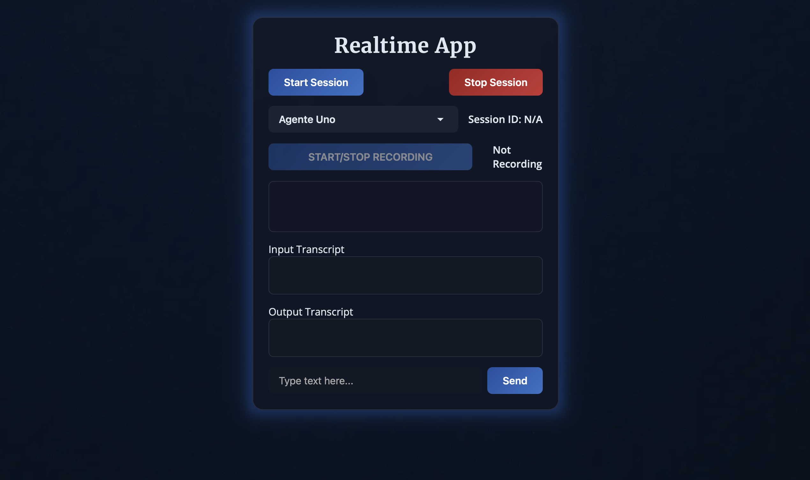

# realtime-agent



Welcome to the `realtime-agent` project! This application is a **multi-agent** app, allowing you to define and interact with multiple agents, each with their own tools and behaviors. The app leverages OpenAI's Realtime API for seamless, real-time audio and text interactions, including agent switching and tool invocation.

## Key Features
- **Multi-agent support:** Define any number of agents in `static/agents.json`.
- **Agent switching:** Agents can request to switch context to another agent, or users can manually switch agents from the interface.
- **Custom tools:** Easily add tools for agents using decorators, or define schemas manually.
- **Realtime audio & text:** Start sessions, record audio, send text, and receive instant transcriptions and TTS playback.

---

## Agents & Configuration

### Defining Agents
Agents are defined in `static/agents.json`. Each agent entry supports the following fields:
- `name`: The agent's name (must be unique).
- `description`: (Optional) Description of the agent.
- `INSTRUCTIONS`: The base prompt/instructions for the agent.
- `SWITCH_CONTEXT`: The prompt appended to `INSTRUCTIONS` when an agent requests a switch (required for agent switching).
- `INITIAL_USER_MESSAGE`: The initial user message sent to the agent at session start (remains as in previous versions).
- `SWITCH_USER_MESSAGE`: (Optional) Prompt sent to the newly switched agent to answer after a switch is requested.
- `SWITCH_NOTIFICATION_MESSAGE`: The output message shown to the agent when a switch is requested (lets the agent know if the switch was successful).
- `TOOL_NAMES`: List of tool names the agent can access. Names must match those defined in `user_tools.py` or `route_tool.py`.
- `TOOL_SCHEMA_LIST`: (Optional) List of schemas for the tools. If omitted, schemas are auto-generated from the tool docstrings.

**Note:** The number of agents in `agents.json` determines how many agents are available in the app.

### Route Tool
- There can only be **one** route tool (decorated with `@route_tool` from `app.utils.tool_utils`).
- If you want agents to be able to switch between each other, include the route tool in their `TOOL_NAMES`.
- You can change the route tool's definition and schema in `app/route_tool.py`.

### Custom Tools
- Define tools using the `@user_tool` decorator from `app.utils.tool_utils` in `user_tools.py`.
- Schemas are auto-generated from docstrings, or you can specify them manually in `TOOL_SCHEMA_LIST`.
- All tool names in `TOOL_NAMES` must match the actual function names in `user_tools.py` or `route_tool.py`.

---

## Getting Started

1. **Create a virtual environment:**
    ```sh
    python -m venv venv
    ```
2. **Activate the virtual environment:**
    - On macOS/Linux:
        ```sh
        source venv/bin/activate
        ```
    - On Windows:
        ```sh
        .\venv\Scripts\activate
        ```
3. **Install requirements:**
    ```sh
    pip install -r requirements.txt
    ```
4. **Set the required environment variable:**
    The only required environment variable is your OpenAI API key:
    ```sh
    export OPENAI_API_KEY="..."
    ```
    You can set this in your shell, or in your deployment environment. No `.env` file is required.
5. **Run the app:**
    ```sh
    python main.py
    ```

---

## Running with Docker

You can also run the app using Docker:

1. **Build the Docker image:**
    ```sh
    docker build -t realtime-agent .
    ```
2. **Run the Docker container:**
    ```sh
    docker run -p 8000:8000 -e OPENAI_API_KEY="..." realtime-agent
    ```
    You can also pass any other environment variables as needed using `-e` flags.
3. **Run the Docker container with a volume for logs:**
    ```sh
    docker run -p 8000:8000 -e OPENAI_API_KEY="..." -v $(pwd)/logs:/app/logs realtime-agent
    ```

---

## Using the Browser Frontend

- **Start/Stop Session:** Use the buttons to control the session. Session ID is displayed.
- **Agent Selection:** Use the dropdown to manually switch between agents at any time.
- **Audio Recording:** Start/stop recording to send audio to the current agent.
- **Text Input:** Type and send text to the current agent.
- **Transcripts:** Input and response transcripts are shown in real time.

---

## Configuration Notes

You can optionally add the following variables to `static/app_config.json` to control logging and error reporting:

- `LOG_LEVEL` (e.g. `DEBUG`, `INFO`)
- `LOG_DIR` (e.g. `./logs`)
- `EXC_INFO` (`True` or `False`)

> **Note:** If you set any of these as environment variables, the environment variable will take priority over the value in `app_config.json`.

---

## Customizing Agents and Tools

- **To add a new agent:** Add an entry to `static/agents.json` with the required fields.
- **To add a new tool:**
    - Define a function in `app/user_tools.py` and decorate it with `@user_tool`.
    - Follow the format of the existing examples in `user_tools.py` (e.g., `obtener_clima`): include the decorator, function signature with typed parameters, and a docstring with a description, `------` separator, and `Parameters` section.
    - Add the tool's name to the agent's `TOOL_NAMES` in `static/agents.json`.
    - (Optional) Add the schemas to `TOOL_SCHEMA_LIST` if you want to override auto-generation.

    Example:
    ```python
    from app.utils.tool_utils import user_tool

    @user_tool
    def ejemplo_herramienta(parametro: str) -> str:
        """Ejemplo de herramienta de usuario dummy que devuelve un saludo.
        ------
        Parameters:
            parametro: Texto de entrada para la herramienta.
        """
        return f"Hola, {parametro}!"
    ```
- **To enable agent switching:**
    - Include the route tool in the agent's `TOOL_NAMES`.
    - Ensure `SWITCH_CONTEXT` and (optionally) `SWITCH_USER_MESSAGE` and `SWITCH_NOTIFICATION_MESSAGE` are set.

---

## Notes
- The number of agents in `agents.json` = number of agents available in the app.
- Only one route tool is allowed per agent.
- You can manually switch agents from the interface at any time.
- All tool names must match the function names in `user_tools.py` or `route_tool.py`.

---